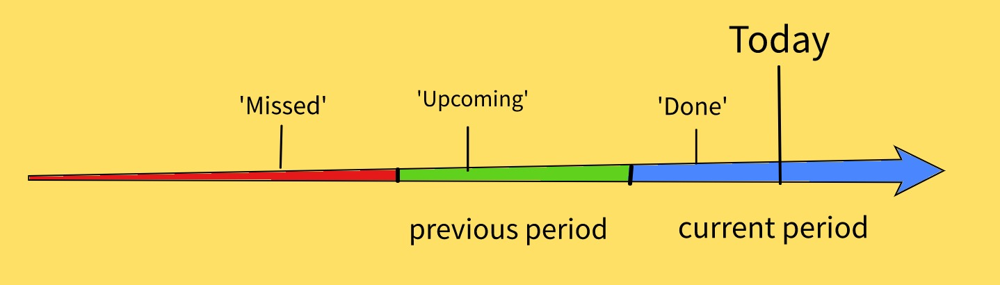

# Tiny Period Checker

#### Table of contents

- [Installation](#installation)
- [About the package](#about-the-package)
  * [Touchpoint definition](#touchpoint-definition)
  * [What it does actually](#what-it-does-actually)
  * [What else it can be used for?](#what-else-it-can-be-used-for)
- [How to use](#how-to-use)
- [Notes](#notes)
  
### Installation

Just go to your project folder and use the good old:
```sh
$ npm i tiny-period-checker
```
### About the package

The purpose of the package itself if we use it as a whole tool is very specific but the problem it solves could be very usual in the relation of customer interactions or touchpoints. However, I found out during intensively checking StackOverflow for proper solutions that maybe some of its functions could be useful in more global use cases when someone has to check periods in time.

But first we need to clarify what is a touchpoint:

#### Touchpoint definition
 What is a 'Touchpoint':
   
  - A touchpoint can be defined as any way a consumer can interact with a business, 
  - Touchpoints in marketing communications are the varying ways that a brand interacts and displays information to prospective customers and current customers.
  - Touchpoints allow customers to have experiences every time they “touch’ any part of the product, service, brand or organization, across multiple channels and various points in time 

#### What it does actually

 With tiny-period-checker we can calculate if a client needs to be contacted soon since it has been contacted (in the code we use the 'clientTouchedAt' property) in the previous period but not in the current one ('Upcoming'), or already reached in the current period ('Done') or it is 'Missed' since it has not been touched in the previous period nor in the current one. The periods (in the code we call them 'frequency') could be 'Monthly', 'Quarterly', and 'Anual'. 
 
 
 
#### What else it can be used for
 
 While I wrote the package, I had to implement a few date related solutions which can be useful on their own. I will explain them in details later.I plan to include some more based on the top StackOverflow searches on this topic. Btw if you have any cool suggestion, do not hesitate to write me on skltr48@gmail.com

### How to use


### Notes

- This little package has no dependencies, no day.js, no moment.js, nothing at all
- I have used UTC time to make (almost) sure that we won't misscalculate because of some server time conversion
- You can check the basic tests in the github repo to understand more the behaviour
- Again, feel free to contact me on skltr@gmail.com
